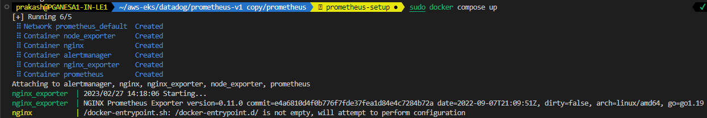

### Prometheus Setup 
Prometheus, a [Cloud Native Computing Foundation](https://cncf.io/) project, is a systems and service monitoring system. It collects metrics
from configured targets at given intervals, evaluates rule expressions,
displays the results, and can trigger alerts when specified conditions are observed.

## Architecture overview


## Install

We going to setup Prometheus, Alert Manager and Nginx in our example

* ```docker-compose.yml``` Docker compose file configured with required container's setup to run in our local machine
* ```prometheus.yml``` configuration file will be copied to prometheus container and this configuration file will be used during the service startup.
* ```nginx.conf``` configuration file configured with ```stub_status``` to provide the metrics to ```nginx node exporter```
* ```nginx_alert_rules.yml``` configuration file has the alert rules to trigger when nginx container goes down.

## How to run docker compose file

# Setup Docker in local machine 


    To start services in docker compose file ```sudo docker compose up```
    To stop services in docker compose file ```sudo docker compose down```

# Docker Compose up


