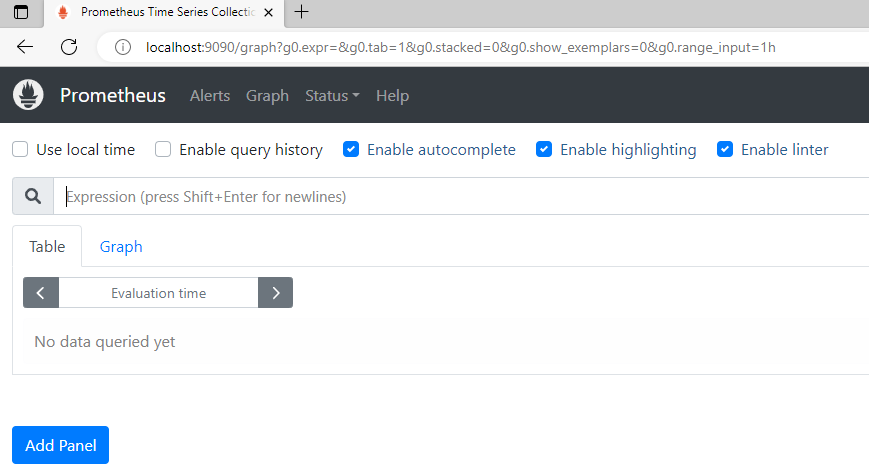
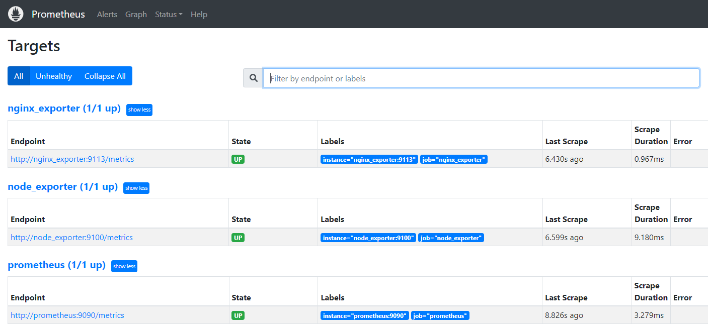
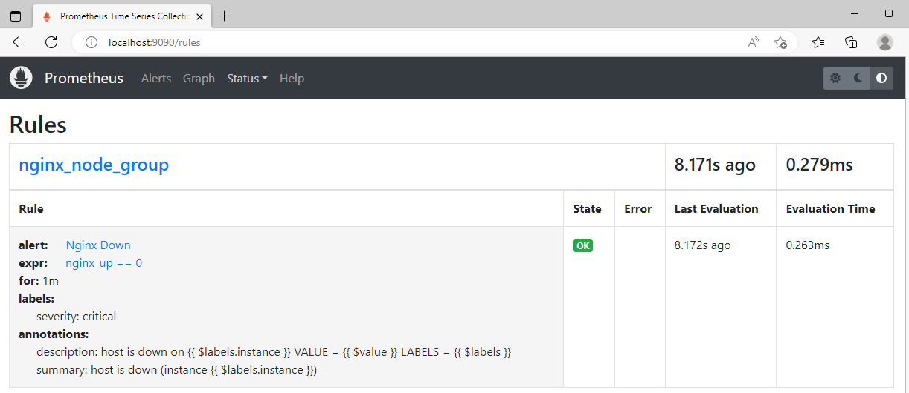
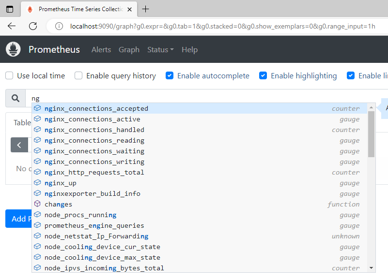
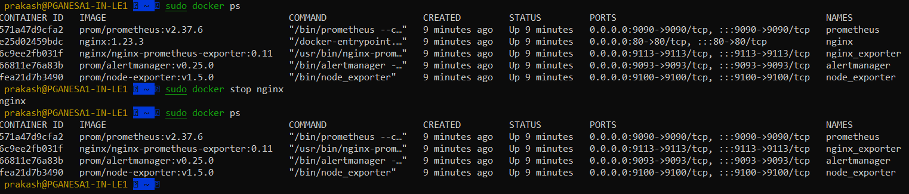
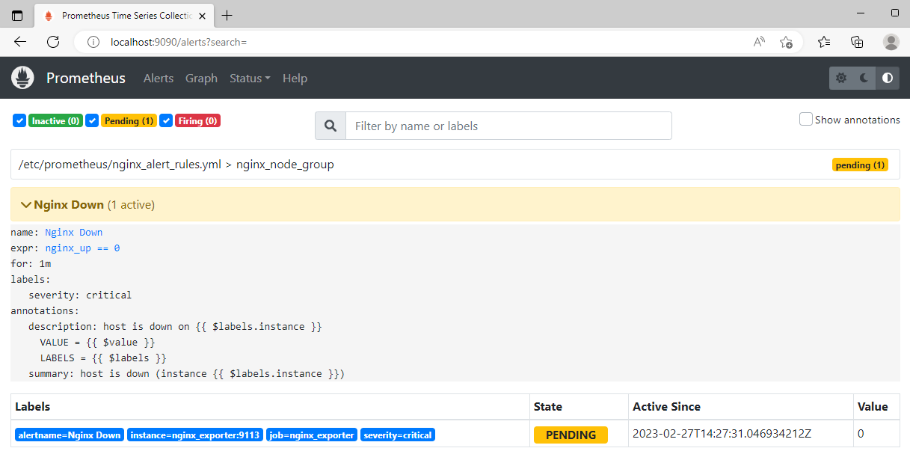
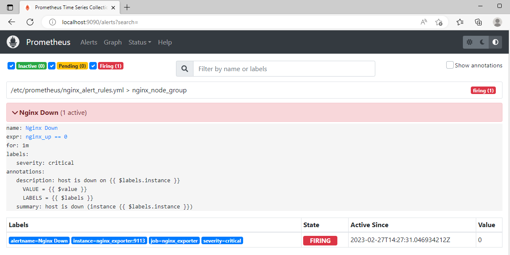
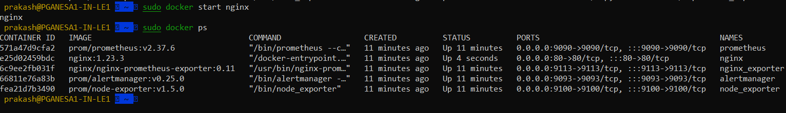
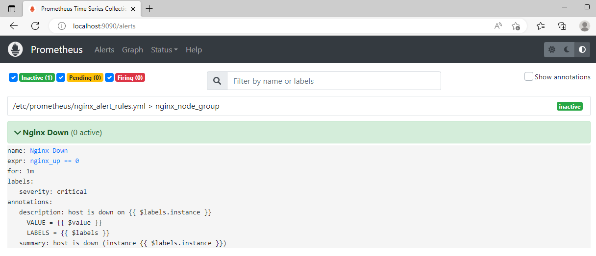

## Prometheus Setup 
Prometheus, a [Cloud Native Computing Foundation](https://cncf.io/) project, is a systems and service monitoring system. It collects metrics
from configured targets at given intervals, evaluates rule expressions,
displays the results, and can trigger alerts when specified conditions are observed.

# Architecture overview


# Config file info

We going to setup Prometheus, Alert Manager and Nginx in our example

* ```docker-compose.yml``` Docker compose file configured with required container's setup to run in our local machine
* ```prometheus.yml``` configuration file will be copied to prometheus container and this configuration file will be used during the service startup.
* ```nginx.conf``` configuration file configured with ```stub_status``` to provide the metrics to ```nginx node exporter```
* ```nginx_alert_rules.yml``` configuration file has the alert rules to trigger when nginx container goes down.

**Docker Compose Install in Ubuntu**
Ref: https://docs.docker.com/engine/install/ubuntu/#set-up-the-repository

### Prometheus up and running

* Command to start the docker compose


* Prometheus status 


* Targets configured in Prometheus


* Nginx alert configuration info


* Nginx alert rules info


* Available nginx plugins to pull the metrics from the nginx


Let's stop the nginx container and will check the alert status



Once container goes down alerts become pending state and will wait for the container state for 1m before triggering the alert



Once the alert reaches 1m and if container is not become active then alert will get started to trigger



Let's start the nginx container will check the alert status 



Once container become active alert will get recovered




